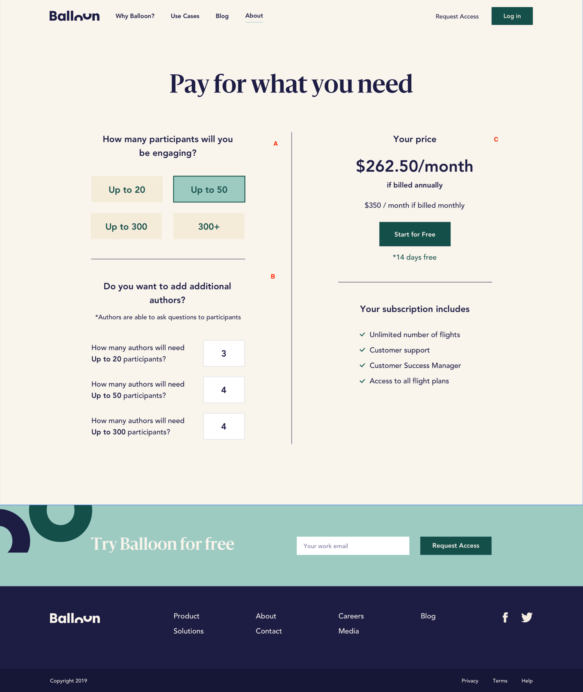

#  Balloon Frontend Challenge

> 🎈 🙇‍♀️🙇‍♂️

## 📝 Requirements

- You need to implement a **clone of our pricing page**. Whatever you want to use, is up to you. You can choose the frameworks, libs, tools and tech stack you want.

- Does not need to be pixel perfect, but you have to **follow the design above**.

- **Plans and their information should be dynamic**, everything else is static content. In this repo, you will find `data.json` file. You can just copy and paste that file in your code, there is not API or HTTP interaction.

- Our pricing model depends on **Participants** and **Authors**. Participants are people that you can add/invite to a **Flight**. Authors are the users that can create a **Flight**. When you create your **Balloon** account, you can set up one or multiple Authors and each of them will have its own Participants limit.

- Your job is to put the pieces together. Create the UI to **allow customers choose the plan** they want (A), but also **allow them to set *additional* authors** for each of the plans (B). Base on those selections, you have to be able to **calculate the final pricing** (C)

- You can make your own assumptions: if something is not clear, ambiguous or could be done in different ways, just make your choice. We are sure you will opt for the best alternative 🙂

> ✅ Check A, B and C in designs. That content is consider dynamic and your duty is to generate that with your programming logic. The rest of the app is just static content.

> ⏱ Do not spend more than ~8 hours on this. If you think you can't complete in that time, just pick a specific part of the project and focus on having something solid and functional.

> 📦 When you are done, just send an email to [noah@getballon.com](noah@getballon.com) and [nacho@getballon.com](nacho@getballon.com). You can send a zip folder with your code, upload it to google drive or push it to a git repo.

## 💅 Design

## 💾 Data

The `data.json` contains an `Array` of objects. Each element in the array represents a pricing plan.

When you implement this, in your application. You should only consider the plans with the property `active === true` and the property `interval === year`. The plans that don't match the condition, must be skipped.

Other properties you will find relevant of each plans are:
- `metadata.limit`: Indicates the limit amount of participant for the plan
- `amount`: Indicates the plan's pricing (the unit is cents)

## 🌉 Assets

Inside `assets` directory, you will find some useful images for design and markup.